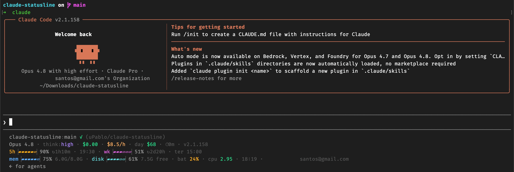

# claude-statusline

[](LICENSE)


A rich, multi-line status line for [Claude Code](https://claude.com/claude-code) — a developer cockpit focused on **account/usage control** plus the dev context you actually want at a glance.

Cross-platform: portable **Bash** (macOS · Linux · Windows Git Bash/WSL) plus a native **PowerShell** build for Windows. No Node runtime per render.

```
prever-app-backend:master ✓ ↑1 (you/prever-app-backend) · ⬢ 20.19.0  🐘 8.4.5 · +1.2k/-340
Opus 4.8 · think:high · $0.11 · $6.8/h · day $51 · ⏱1m · v2.1.158
ctx▕▱▱▱▱▱▱▏3% 29k/1M cache36% · 5h▕▰▰▰▰▱░▏52% ↻2h48m · 19:30 · wk▕▰▰▰▱▱▱▏46% ↻2d22h · ter 15:00
mem▕▰▰▰▰▱▱▏70% 5.6G/8.0G · disk▕▰▰▰▱▱▱▏55% 9.6G livre · bat 55% · cpu 2.72 · 16:41 · you@example.com
```

> Colors render per metric (cyan context, amber 5h, pink weekly, etc.); the block above is plain text.

## Screenshot



## Layout — 4 logical lines

| Line | Focus | Shows |
|------|-------|-------|
| **1 — Code** | where you are | `dir:branch` · git state (`✓`/`●N` to commit, `↑↓` push/pull, `⚑N` stash, `MERGE/REBASE`) · `(owner/repo)` · language(s) with emoji + version · `+adds/-dels` |
| **2 — Claude** | session | model · thinking effort · session `$cost` · burn rate `$/h` · daily `$` · session duration · output style / vim / version |
| **3 — Limits** | account control | context window (% + tokens + cache hit) · 5h · weekly · per-model Opus/Sonnet — each with a `↻countdown · absolute reset` |
| **4 — System** | machine | memory · free disk · battery · CPU load · clock · account email |

## Features

- **Framed unicode progress bars** (`▕▰▱▏`), one color per metric.
- **Usage limits** with both a countdown *and* the absolute reset time (`↻2h48m · 19:30`, `↻2d22h · ter 15:00`).
- **Per-model weekly limits** (Opus / Sonnet) — relevant on Max plans where Opus has its own cap.
- **Context window**: percentage, exact token count, and prompt-cache hit %.
- **Burn rate & daily spend** via [`ccusage`](https://github.com/ryoppippi/ccusage) (cached 60s).
- **Git**: commit-readiness, ahead/behind, stash count, in-progress state, `owner/repo`.
- **Multi-language auto-detect** with emoji + real version: ⬢ node · 🐘 php · 🐍 python · 🐹 go · 💎 ruby · 🦀 rust · 🥟 bun · 🦕 deno. Node respects the project pin (`.nvmrc`/`.node-version`/`.tool-versions`) or the nvm default. Cached per directory.
- **System**: memory, free disk, battery (+charging), CPU load.

## Platforms

| File | Covers | Engine |
|------|--------|--------|
| `status-line.sh` | **macOS · Linux · Windows (Git Bash / WSL)** | portable Bash — detects the OS and swaps the ~6 platform-specific bits (memory, battery, CPU, date, stat, paths) |
| `windows/status-line.ps1` | **Windows (native, no Bash)** | PowerShell 7+ |

## Requirements

**Bash version** (`status-line.sh`):
- [`jq`](https://jqlang.github.io/jq/) — required.
- [`ccusage`](https://github.com/ryoppippi/ccusage) — optional, for burn rate + daily cost.
- [`nvm`](https://github.com/nvm-sh/nvm) — optional, for the active Node version.

**PowerShell version** (`windows/status-line.ps1`):
- PowerShell 7+ (`pwsh`). No `jq` needed (uses `ConvertFrom-Json`).
- `ccusage` optional.

## Install

### macOS · Linux · Windows (Git Bash / WSL)

```bash
mkdir -p ~/.claude/scripts
cp status-line.sh ~/.claude/scripts/status-line.sh
chmod +x ~/.claude/scripts/status-line.sh
```

In `~/.claude/settings.json`:

```json
{
  "statusLine": {
    "type": "command",
    "command": "bash ~/.claude/scripts/status-line.sh",
    "refreshInterval": 10
  }
}
```

Or run `./install.sh`.

### Windows (native PowerShell)

```powershell
.\windows\install.ps1
```

In `%USERPROFILE%\.claude\settings.json`:

```json
{
  "statusLine": {
    "type": "command",
    "command": "pwsh -NoProfile -File \"%USERPROFILE%\\.claude\\scripts\\status-line.ps1\"",
    "refreshInterval": 10
  }
}
```

### After installing

**Restart Claude Code** — the `statusLine` *command* is read at session start. Editing the script file afterwards is live (no restart needed for script changes).

> ℹ️ The PowerShell version is **validated against PowerShell 7.7** (syntax + core rendering). The Windows-only system metrics (memory / disk / battery / CPU via WMI) haven't been run on real Windows hardware yet — open an issue if one misbehaves.

## Customize

All knobs live at the top of `status-line.sh`:

- `BAR_WIDTH` — segments per bar (default `6`).
- `C_*` — per-metric colors (256-color ANSI codes).
- `ISEP` — separator between items.

Lines and segments hide themselves when their data is absent, so it degrades gracefully (no git repo → no git cluster; desktop → no battery; no `ccusage` → no burn rate).

## How it works

Claude Code pipes a JSON payload to the status-line command on each render. This script reads it with `jq`, computes a few things the payload doesn't carry (memory, disk, battery, language versions, account email — all from the filesystem/syscalls, never from your shell env, which isn't inherited), and prints up to 4 lines.

## Credits

Inspired by [ccstatusline](https://github.com/sirmalloc/ccstatusline) and [Starship](https://starship.rs/).

## License

MIT — see [LICENSE](LICENSE).
